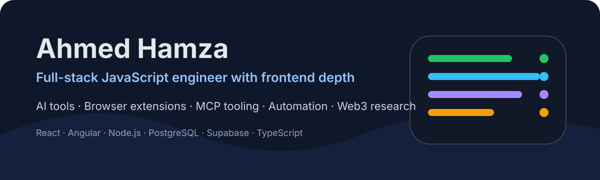

<p align="center">
  
</p>

# Ahmed Hamza

Full-stack JavaScript engineer with frontend depth.

Most of my repos are me turning things I actually need into working tools: a cleaner way to feed web pages to LLMs, a code-search layer for coding agents, browser extensions that remove repeated friction, and crypto research scripts I can inspect instead of just talk about.

I care about the parts that make a project trustworthy after the first demo: readable UI, small release checks, fixtures for annoying edge cases, docs that match behavior, and code I can come back to without hating past-me.

<p>
  <a href="https://hamza.my.id"></a>
  <a href="https://linkedin.com/in/hamzax"></a>
  <a href="mailto:contactgraftcode@gmail.com"></a>
</p>

## What I Am Working On

- [Satori](https://github.com/ham-zax/satori), a code-search and MCP workflow tool for coding agents that need better repo evidence before editing.
- [PromptReady](https://github.com/ham-zax/promptready_extension), a Chrome/Chromium extension for turning messy pages into clean Markdown and JSON.
- [AI Studio Prompt Library](https://github.com/ham-zax/ai-studio-prompt-library), a local-first extension for reusable AI Studio prompts.
- [tradingview_ratio](https://github.com/ham-zax/tradingview_ratio), a research-to-code crypto project around quantitative signals and portfolio checks.
- [hamza.my.id](https://hamza.my.id), my writing-first portfolio for project notes, retrospectives, and technical notes.

## Selected Work

| Project | What it shows |
|---|---|
| [Satori](https://github.com/ham-zax/satori) | MCP server, CLI, indexing, semantic code search, call graph context, package/docs/release discipline |
| [PromptReady](https://github.com/ham-zax/promptready_extension) | Chrome extension architecture, offline capture, Markdown fidelity, optional direct OpenRouter BYOK cleanup |
| [AI Studio Prompt Library](https://github.com/ham-zax/ai-studio-prompt-library) | Chrome MV3 extension work, local-first UX, prompt workflow tooling |
| [Portfolio](https://github.com/ham-zax/portfolio) | Astro, MDX, content collections, technical writing, clean static-site delivery |
| [tradingview_ratio](https://github.com/ham-zax/tradingview_ratio) | Research-to-code translation for quantitative crypto tooling and portfolio analysis |

## Engineering Range

```txt
Frontend      React, Angular, Astro, Tailwind CSS, UI systems
Backend       Node.js, APIs, PostgreSQL, Supabase, auth flows
AI tooling    OpenRouter, prompt workflows, agent-facing retrieval, MCP
Automation    Puppeteer, content migration scripts, local developer tools
Web3          DeFi interfaces, crypto research tooling, signal experiments
Quality       Tests, fixtures, release checks, docs, regression-focused fixes
```

## Recent Activity

<!--START_SECTION:activity-->
1. 💪 Opened PR [#6](https://github.com/ham-zax/satori/pull/6) in [ham-zax/satori](https://github.com/ham-zax/satori)
2. 🗣 Commented on [#1288](https://github.com/PrimeIntellect-ai/prime-agent/issues/1288#issuecomment-5268729396) in [PrimeIntellect-ai/prime-agent](https://github.com/PrimeIntellect-ai/prime-agent)
<!--END_SECTION:activity-->

## GitHub Activity

These cards are generated from my public GitHub activity by this profile repository's own GitHub Actions, so the profile does not depend on the paused `github-readme-stats.vercel.app` service.

<p align="center">
  
</p>

<p align="center">
  
  
</p>

<p align="center">
  
  
</p>

<picture>
  <source media="(prefers-color-scheme: dark)" srcset="https://raw.githubusercontent.com/ham-zax/ham-zax/output/github-contribution-grid-snake-dark.svg" />
  <source media="(prefers-color-scheme: light)" srcset="https://raw.githubusercontent.com/ham-zax/ham-zax/output/github-contribution-grid-snake.svg" />
  
</picture>

## Current Focus

- Deepening backend/database fundamentals with Node.js and PostgreSQL
- Shipping small, useful AI and automation tools instead of demo-only experiments
- Turning research papers and protocol ideas into working code I can test
- Writing up the tradeoffs and mistakes behind the projects, not just the finished features

## Writing

I write project notes, retrospectives, and engineering breakdowns at [hamza.my.id](https://hamza.my.id).
